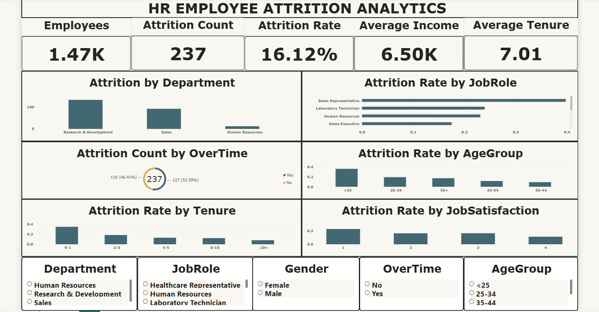
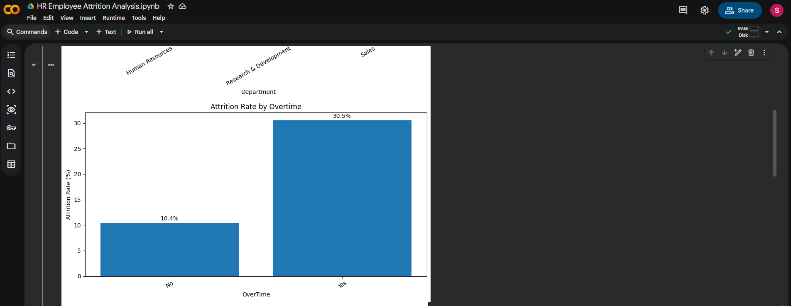
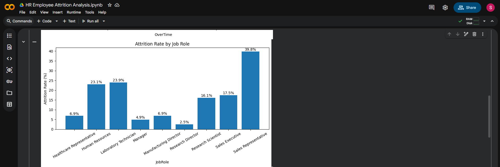
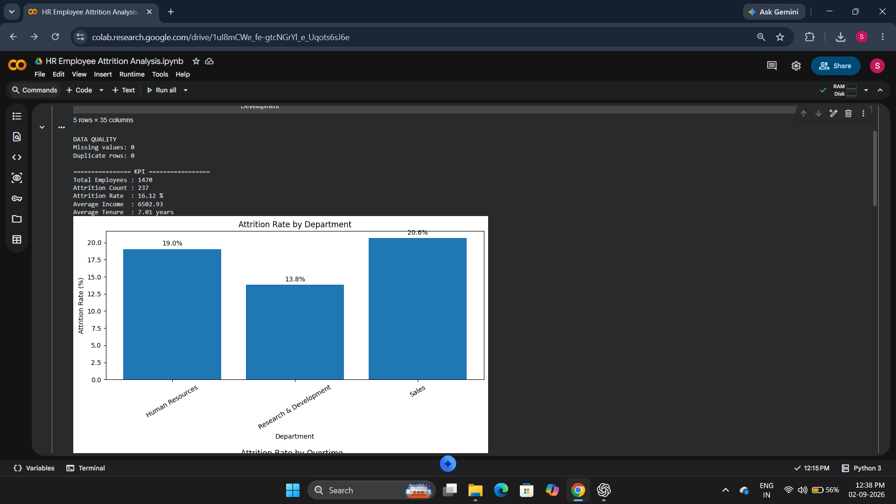
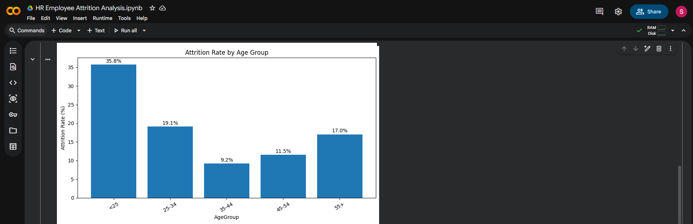
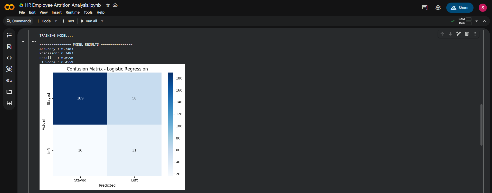
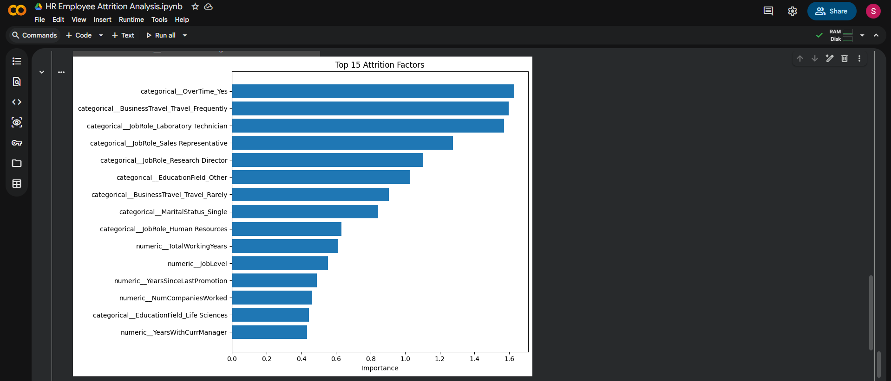

# HR Employee Attrition & Retention Analysis

## 📊 Project Overview

This project analyzes employee attrition patterns and identifies important factors associated with employee turnover using **Python, Machine Learning and Power BI**.

The objective is to understand why employees leave an organization and identify employee groups that may require additional retention attention.

---

## 🎯 Project Objectives

- Analyze employee attrition patterns
- Identify major factors associated with employee turnover
- Perform Exploratory Data Analysis (EDA)
- Build a Machine Learning model to predict employee attrition
- Evaluate model performance
- Analyze important attrition factors
- Create an interactive Power BI dashboard
- Provide HR-focused retention recommendations

---

## 🛠️ Tools & Technologies

- Python
- Pandas
- NumPy
- Matplotlib
- Seaborn
- Scikit-learn
- Logistic Regression
- Power BI
- Excel

---

## 📁 Dataset

The project uses the **IBM HR Analytics Employee Attrition dataset**.

### Dataset Information

- **Employees:** 1,470
- **Columns:** 35
- **Missing Values:** 0
- **Duplicate Rows:** 0
- **Target Variable:** Attrition

---

# 🔎 Exploratory Data Analysis

The analysis examines employee attrition across:

- Department
- Overtime
- Job Role
- Age Group
- Tenure
- Job Satisfaction
- Employee Income

### Key Findings

| Metric | Result |
|---|---:|
| Total Employees | 1,470 |
| Employees Who Left | 237 |
| Overall Attrition Rate | 16.12% |
| Average Monthly Income | 6502.93 |
| Average Tenure | 7.01 years |
| Highest Department Attrition | Sales – 20.63% |
| Highest Job Role Attrition | Sales Representative – 39.76% |
| Highest Age Group Attrition | Below 25 – 35.77% |
| Highest Tenure Group Attrition | 0–1 Years – 34.88% |

---

# 📈 Power BI Dashboard

The Power BI dashboard provides an interactive view of employee attrition and includes:

- Total Employees
- Attrition Count
- Attrition Rate
- Average Income
- Average Tenure
- Attrition by Department
- Attrition by Job Role
- Attrition by Overtime
- Attrition by Age
- Attrition by Tenure
- Interactive slicers and filters

## Dashboard Preview

---

# 📊 Data Analysis Visualizations

## Attrition by Overtime

## Attrition by Job Role

## Attrition by Department

## Attrition by Age Group

---

# 🤖 Machine Learning

A **Logistic Regression** classification model was developed to predict employee attrition.

### Data Preparation

- Numerical variables were standardized
- Categorical variables were converted using One-Hot Encoding
- Dataset was divided into training and testing sets
- Logistic Regression was trained using employee characteristics

---

# 📌 Model Performance

| Evaluation Metric | Result |
|---|---:|
| Accuracy | 74.83% |
| Precision | 34.83% |
| Recall | 65.96% |
| F1 Score | 45.59% |

## Confusion Matrix

---

# ⭐ Feature Importance

Feature coefficients from the Logistic Regression model were analyzed to understand variables that had stronger influence on attrition classification.

---

# 💡 Business Recommendations

Based on the analysis, the following actions are recommended:

1. **Monitor overtime**  
   Employees working overtime should be monitored for workload and work-life balance issues.

2. **Improve career development**  
   Provide training, career progression and internal mobility opportunities.

3. **Review compensation**  
   Review compensation and salary progression for employee groups experiencing higher attrition.

4. **Improve employee engagement**  
   Use regular employee feedback and engagement initiatives to identify workplace concerns.

5. **Focus on high-risk groups**  
   Give additional retention attention to high-attrition departments, job roles, younger employees and newer employees.

6. **Use predictive analytics**  
   Machine Learning can support HR teams in identifying employees who may require proactive retention attention.

---

# 📂 Project Structure

HR-Employee-Attrition-Analytics/
│
├── Python/
│   └── HR_Employee_Attrition_Analysis.ipynb
│
├── Data/
│   └── HR_Attrition_PowerBI.csv
│
├── PowerBI/
│   └── HR_Employee_Attrition_Dashboard.pbix
│
├── Results/
│   ├── PowerBI_Dashboard.png
│   ├── confusion_matrix.png
│   ├── feature_importance.png
│   ├── attrition_by_department.png
│   ├── attrition_by_overtime.png
│   ├── attrition_by_jobrole.png
│   └── attrition_by_age.png
│
├── Report/
│   └── HR_Employee_Attrition_Project_Report.pdf
│
└── README.md
---
# 🧪 Project Workflow

Data Collection
      ↓
Data Cleaning
      ↓
Feature Engineering
      ↓
Exploratory Data Analysis
      ↓
Attrition Analysis
      ↓
Machine Learning
      ↓
Model Evaluation
      ↓
Feature Importance
      ↓
Power BI Dashboard
      ↓
Business Recommendations

# 📄 Project Deliverables

1.Python Data Analysis Notebook
2.Cleaned HR Dataset
3.Logistic Regression Model Analysis
4.Model Evaluation
5.Confusion Matrix
6.Feature Importance Analysis
7.Power BI Dashboard
8.Project Report
9.Business Recommendations

# ✅ Conclusion

This project demonstrates an end-to-end data analytics workflow for understanding employee attrition.

The analysis identified an overall attrition rate of 16.12% among 1,470 employees. Higher attrition was observed among employees in the Sales department, Sales Representatives, employees below 25 years of age, and employees with 0–1 years of tenure.

The Logistic Regression model achieved 74.83% accuracy and 65.96% recall. Combined with the Power BI dashboard, the project provides data-driven insights that can support employee retention and workforce planning decisions.
